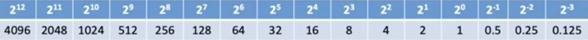
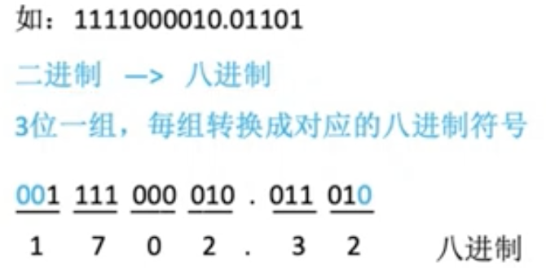
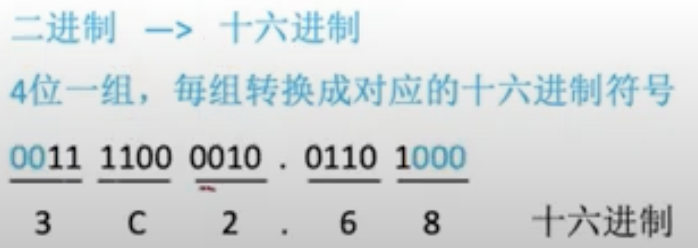
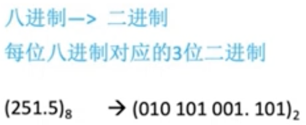
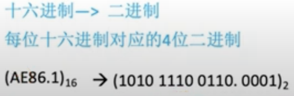
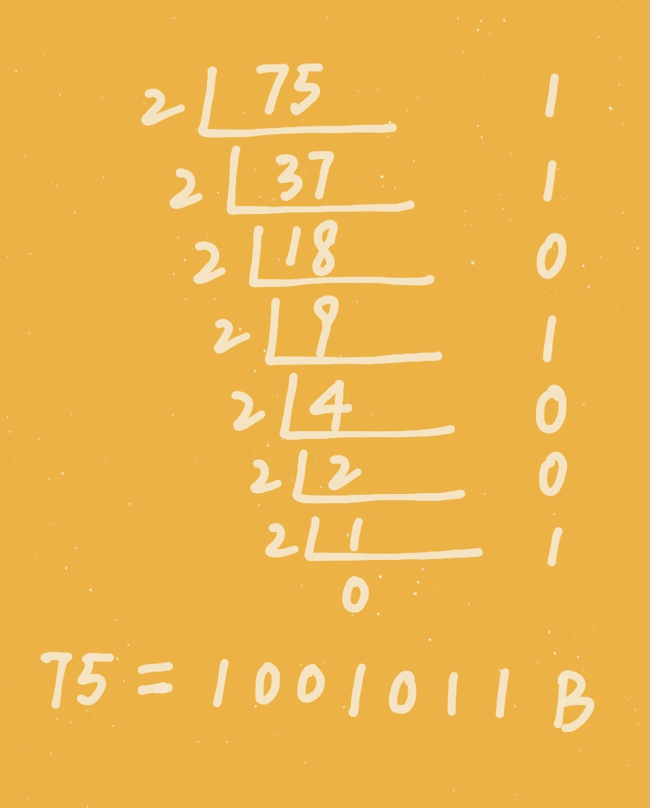

# 进制转换

在日常生活中我们一般使用十进制数，但是计算机识别的是二进制数，为了帮助理解所以产生了八进制数以及十六进制数，总结下来数字有以下几种表现形式，分别是：

- 二进制：0，1；表现形式：0101B、$(0101)_2$
- 八进制：0，1，2，3，4，5，6，7；表现形式：$(1652)_8$
- 十进制：0，1，2，3，4，5，6，7，8，9；表现形式：1652D
- 十六进制（0～15）：0，1，2，3，4，5，6，7，8，9，A，B，C，D，E，F；表现形式：$(1652)_{16}$、1652H、0x1652

##其他进制转十进制

我们直接看几个例子：

- 二进制->十进制：$101.1=1\times2^2+0\times2^1+1\times2^0+1\times2^{-1}=5.5$
- 八进制->十进制：$5.4=5\times8^0+4\times8^1=5.5$
- 十六进制->十进制：$5.8=5\times16^0+8\times16^{-1}=5.5$

下面这张图片是二进制数各位对应十进制的关系表。

##二进制转八、十六进制进制

二进制转八进制

二进制转十六进制

## 八进制、十六进制转二进制

八进制转二进制

十六进制转二进制

## 十进制转其他进制

### 十进制转二进制

十进制转二进制需要分为整数和小数两个部分，以75.3为例，先将整数部分转为二进制数，这里我们采用短除法。

</img>

