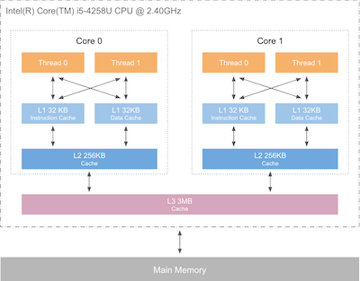

# 什么是CPU缓存
CPU缓存是位于CPU与内存之间的临时数据交换器，它的容量比内存小的多但是交换速度却比内存要快得多。CPU缓存一般直接跟CPU芯片集成或位于主板总线互连的独立芯片上。

# 为什么需要CPU缓存
随着多核CPU的发展CPU的频率越来越快，快到主存跟不上，这样在处理器时钟周期内，CPU常常需要等待主存，浪费资源。所以cache的出现就是为了缓解CPU和内存之间速度的不匹配问题CPU缓存通常分成了三个级别：`L1`，`L2`，`L3`。级别越小越接近CPU，所以速度也更快，同时也代表着容量越小。L1是最接近CPU的, 它容量最小（例如：`32K`），速度最快，每个核上都有一个 L1 缓存，L1 缓存每个核上其实有两个 L1 缓存, 一个用于存数据的 L1d Cache（Data Cache），一个用于存指令的 L1i Cache（Instruction Cache）。L2缓存 更大一些（例如：`256K`），速度要慢一些, 一般情况下每个核上都有一个独立的 L2 缓存;  L3 缓存是三级缓存中最大的一级（例如3MB），同时也是最慢的一级, 在同一个CPU插槽之间的核共享一个L3缓存。但是CPU缓存都比较小保存那么一点数据有意义么？这样设计是有意义的，主要是因为[[局部性原理]]。

读取数据过程。就像数据库缓存一样，首先在最快的缓存中找数据，如果缓存没有命中(Cache miss) 则往下一级找, 直到三级缓存都找不到时，向内存要数据。一次次地未命中，代表取数据消耗的时间越长。

计算过程。程序以及数据被加载到主内存；指令和数据被加载到CPU的高速缓；CPU执行指令，把结果写到高速缓存；高速缓存中的数据写回主内存。

# CPU缓存结构

