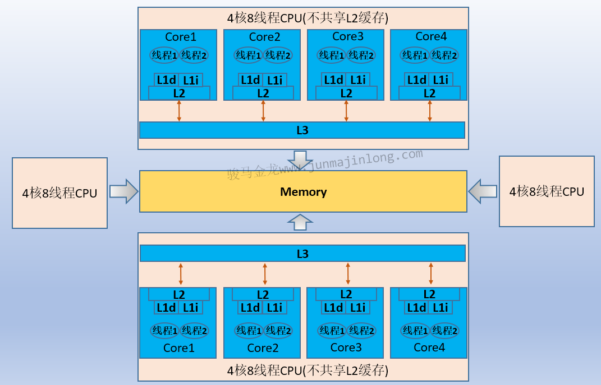
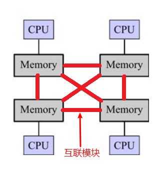
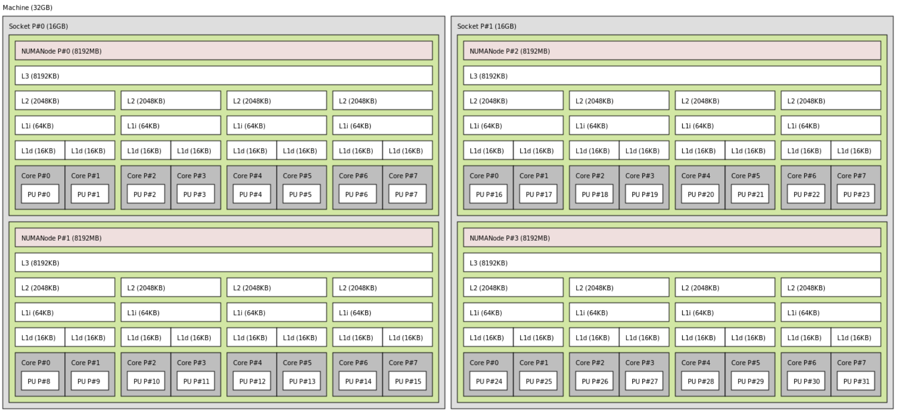

# CPU缓存
CPU缓存是位于CPU与内存之间的临时数据交换器，它的容量比内存小的多但是交换速度却比内存要快得多。CPU缓存一般直接跟CPU芯片集成或位于主板总线互连的独立芯片上。


随着多核CPU的发展，CPU缓存通常分成了三个级别：`L1`，`L2`，`L3`。级别越小越接近CPU，所以速度也更快，同时也代表着容量越小。L1 是最接近CPU的, 它容量最小（例如：`32K`），速度最快，每个核上都有一个 L1 缓存，L1 缓存每个核上其实有两个 L1 缓存, 一个用于存数据的 L1d Cache（Data Cache），一个用于存指令的 L1i Cache（Instruction Cache）。L2 缓存 更大一些（例如：`256K`），速度要慢一些, 一般情况下每个核上都有一个独立的L2 缓存; L3 缓存是三级缓存中最大的一级（例如3MB），同时也是最慢的一级, 在同一个CPU插槽之间的核共享一个 L3 缓存。

读取数据过程。就像数据库缓存一样，首先在最快的缓存中找数据，如果缓存没有命中(Cache miss) 则往下一级找, 直到三级缓存都找不到时，向内存要数据。一次次地未命中，代表取数据消耗的时间越长。

计算过程。程序以及数据被加载到主内存；指令和数据被加载到CPU的高速缓；CPU执行指令，把结果写到高速缓存；高速缓存中的数据写回主内存

# 多CPU
对于多颗CPU的架构组织方式，有：
- AMP(Asymmetric multiprocessing)：非对称多处理器结构
- SMP(Symmetric multiprocessing)：对称多处理器结构
- UMA(Uniform memory access)：一致存储访问结构
- NUMA(Non-uniform memory access)：非一致存储访问结构
- MPP(massively parallel processing)：大规模(海量)并行处理结构

通常会拿来说明的是SMP和NUMA，MPP是海量并行处理结构。


# SMP
对称多处理结构，认为所有CPU的角色是平等的，所有CPU都共享内存、总线等资源。其实单颗多核的CPU内部的多核组织方式也是SMP结构，所有的核心都共享内存、总线资源。



对于SMP结构来说，由于每颗CPU都需要操作共享存储：内存，所以需要保证内存数据的一致性(即缓存一致性)。比如CPU1里的Core1修改数据A，假如采用bus snooping缓存一致性策略，需要在总线发送广播通知所有CPU的所有Core使它们对数据A的缓存失效。如果CPU数量较少，问题并不大，但是随着CPU数量增多，因缓存一致性和共享对象导致的总线流量会暴增。

所以SMP结构并不利于扩展更多CPU，比如2-4颗CPU可考虑SMP架构，但4颗CPU以上便不适合使用SMP。

# NUMA
NUMA(非一致存储访问结构)结构使得各个CPU有自己的内存资源，通过各CPU之间的互联模块，各CPU也可以访问其它CPU的内存资源。



因为CPU都有自己本地的内存，可以各自管理自己的内存保证自己的缓存一致性。但是，因为各CPU各自的内存分离开了，使得CPU1通过互联模块访问CPU2的内存速度很慢(因为通过中间数据传输介质且距离更远)，所以使用NUMA结构时，程序应尽量避免CPU之间的交互并行。

此外，CPU数量越多，跨CPU访问内存的距离可能会越远，速度会越差，所以NUMA结构的性能并不能随CPU数量的增加而线性增长。

下图是4个CPU组成NUMA结构，总共32核，总共分配32G内存，每颗CPU分配8G内存作为自己的本地内存。



```
转载自：
作者: 骏马金龙
链接: https://www.junmajinlong.com/os/multi_cpu/
来源: 骏马金龙
著作权归作者所有。商业转载请联系作者获得授权，非商业转载请注明出处。
```

# 多核cpu下cache如何保持一致性