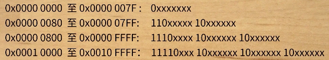
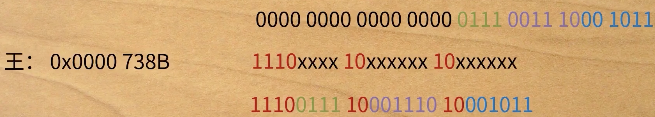

# ASCII
怎么表示常用的字符，可以使用ASCII来进行编码，如何将对应的字符存储到计算机中，直接将ASCII码中的码位或者编号的二进制存储到计算机中。所以它只能表示从0-127共128个字符。但是这些字符无法满足其他国家的需求，就衍生出拓展ASCII码，新增了128个字符，成为拓展ASCII字符集。但是仍然无法满足像汉字这些语言的需要。所以为了表示所有字符就要先设计字符集
# GB2312
为了解决上面的问题，就需要先设计字符集，使用分区管理，共计94个区，每个区含94位，共8836个码位。
- 01-09区收录除汉字外的682个字符
- 10-15区位空白区，没有被使用
- 16-55区收录3755个一级汉字，按拼音排序
- 56-87区收录3008个二级汉字，按部首/笔画排序
- 88-94区位空白区，没有使用
通过这种方式设计的就称为GB2312字符集。

例如y在03区的第8行第9列，它的字符码位就为0389，饼在17区第9行第3列，它的字符码位为1793。

如何在计算机中仅从存储呢？

以侃5709为例，将57和09分别转换为十六进制表示为0x39与0x09将他们分别加上0xA0则为0xD9和0xA9，将其合并为0xD90xA9就为侃的编码。
加A0是为了将GB2312与ASCII进行区分，大于127的久违GB2312编码，所以GB2312的高位和低位都大于127.
# GBK
但是GB2312仍然无法满足汉字的需要，所以GBK就规定低位不再高于127了只要高位大于127即可。
# GB18030
收录了一些少数民族的字符
# Unicode标准
为了统一各个国家的编码，ISO推出Unicode编码。首先推出UCS-2编码但是不满足需求，就产生了UCS-4.
# UTF-8编码规则
将UCS-4分为四组，每次传输8位数据，是一种可变长的编码格式。

通过上图的这种规定形式来变长的表示字符。下图以王为例：

转换成最终的十六进制就是0xe70x8e0x8b。
# 推荐资源
- [非常详细的字符编码讲解，ASCII、GB2312、GBK、Unicode、UTF-8等知识点都有](https://www.bilibili.com/video/BV1gZ4y1x7p7/?spm_id_from=autoNext)