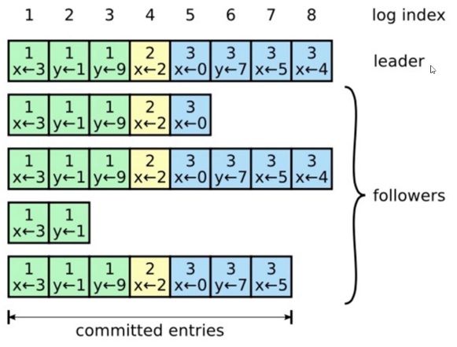

Raft是强一致的集群日志同步算法。

# 日志格式：

可以看到8之前的数据都已经复制给集群中的大多数，所以1-7都可以提交。

# 概念：
- replication：日志在leader生成，向follower复制，达到各个节点的日志序列最终一致
- term：任期，重新选举产生的leader，其term单调递增。
- log index：日志行在日志序列的下标

# Raft异常场景

# 参考文献
- [Raft笔记](https://docs.qq.com/doc/DY0VxSkVGWHFYSlZJ)